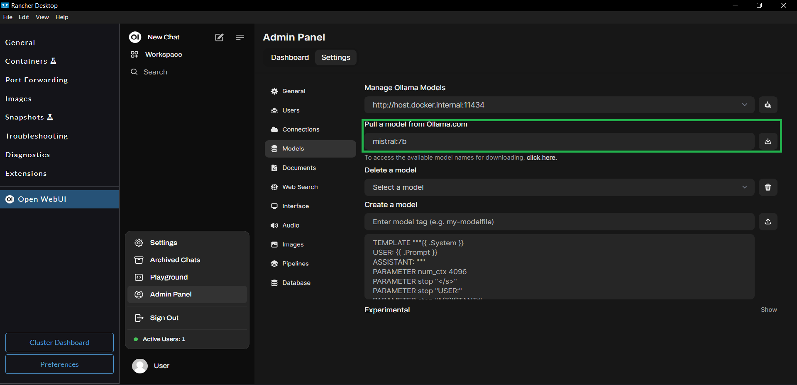
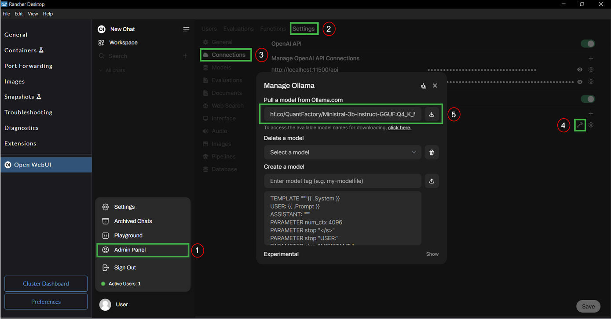
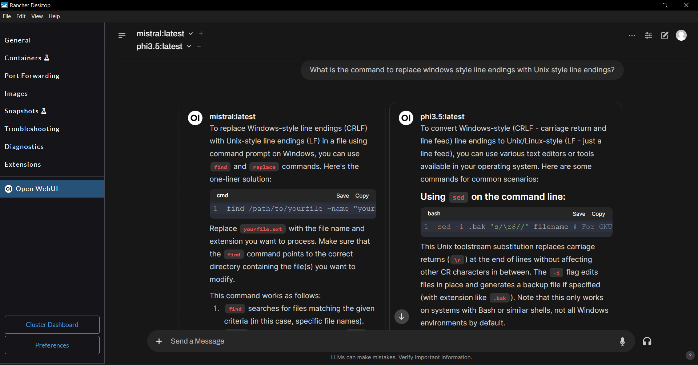
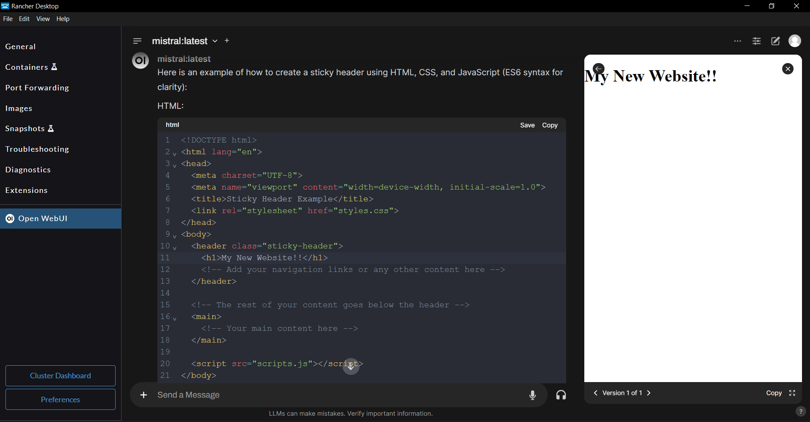
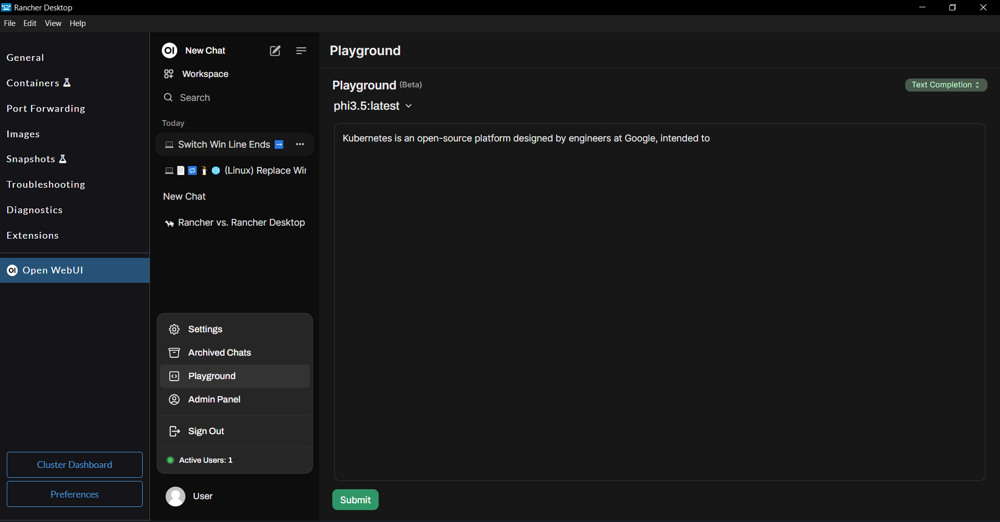
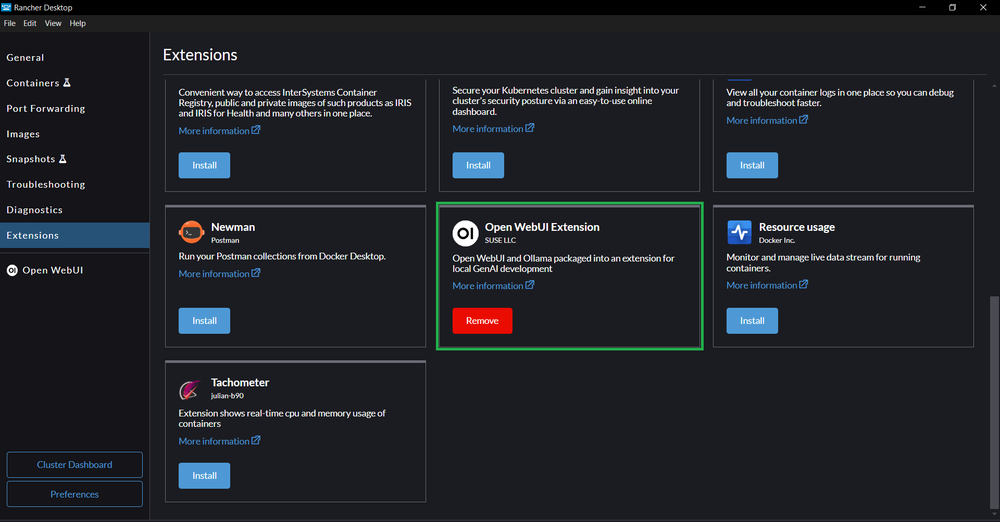

The **Rancher Desktop's Open WebUI extension** provides an easy-to-install setup, comprising the components listed below, for local GenAI use and development.

- [Ollama](https://ollama.com/) to pull, run, fine-tune open-source LLMs
- [Open WebUI](https://openwebui.com/) to chat with the LLMs, use custom knowledge, web search etc., via a feature rich Graphical User Interface (GUI)
- A lightweight LLM called [tinyllama](https://ollama.com/library/tinyllama) to enable you kickstart your LLM exploration
- [SearXNG](https://github.com/searxng/searxng) for web search to enhance retrieval augmented generation (RAG) results

## Installing the Open WebUI extension

:::important
The Open WebUI extension depends on the host machine's ports 11434, 11500 and 11505 for the Ollama, Open WebUI, and the SearXNG services respectively. Please ensure other applications or services on your machine do not occupy these host ports.
:::

### Minimum Requirements

In addition to the general Rancher Desktop [installation requirements](../getting-started/installation.md), you should meet the requirements listed below for the Open WebUI extension. 

- Rancher Desktop version 1.17 or above
- 7 GB available disk space
- 16 GB RAM (recommended)

### Steps to install

You can install the Open WebUI extension via the [Extensions Catalog](../ui/extensions.md#catalog) GUI or via the [rdctl CLI](../references/rdctl-command-reference.md#rdctl-extension-install).

:::caution
Please note that the installation process can take several minutes depending on your internet speed, machine performance etc. 
:::

<Tabs groupId="container-runtime">
  <TabItem value="Extension Catalog (GUI)" default>

    Installing the Open WebUI extension is simple. 

    - Navigate to the `Extensions` page
    - Install the Open WebUI extension

    

  </TabItem>
  <TabItem value="CLI">

Run the command below to install the extension.

```
rdctl extension install ghcr.io/rancher-sandbox/rancher-desktop-rdx-open-webui:latest
```
  </TabItem>
</Tabs>

:::note
- The extension will skip the Ollama installation if it is already available on your machine. Otherwise, it downloads and installs Ollama into the extension's installation directory.
- If the host machine has NVIDIA GPU and the respective drivers, Ollama utilizes the host machine's GPU to run inferences.
:::

## Using Open WebUI

This section provides information and instructions to help you navigate some of Open WebUI's most commonly used features. For up-to-date information about the full capabilities and usage instructions, please refer to the [Open WebUI documentation](https://docs.openwebui.com/).

### Pulling Ollama Open Source LLMs

The extension provides a lightweight LLM called [tinyllama](https://ollama.com/library/tinyllama) out of the box that you can use to start your LLM exploration. The tinyllama is a basic language model good enough to try out simpler text generation and summarization tasks. If you want to perform more advanced tasks, then you need to download bigger models such as llama, mistral, gemma, etc.

You can pull Ollama models via the `Admin Panel > Settings > Models` page. Simply enter the name:tag of the model you want to pull and click on the `pull` button. You can find the full list of available models on the [Ollama Models Library page](https://ollama.com/library).



### Using GGUF models from Huggingface

Recent developments from Ollama and Huggingface make it very simple to use `GGUF` models from Huggingface with Ollama. Follow the steps below to pull a `GGUF` model in the Open WebUI GUI.

- Select a model in `GGUF` format on Huggingface and navigate to the model's page.
- On the page, Click on the `Use this model` button and select `Ollama` in the menu.
- From the pop-up dialog, take the full model name along with the tag. For example, the full model name shown in the image below is `hf.co/QuantFactory/Ministral-3b-instruct-GGUF:Q4_K_M`.

:::tip
Pick the `Q4_K_M` quantization of the `GGUF` models on Huggingface, as this variant generally seems to strike a good balance between the model size and the performance for local usage.
:::


- Navigate to the Models page in the Open WebUI, `Admin Panel > Settings > Models`.
- Enter the full model name in the `Pull a model from Ollama.com` field and click on the download button. Once the model is downloaded, you can use it with the Chat and the Playground features.



### Using OpenAI-compatible APIs

You can use OpenAI-compatible APIs from a local server such as [localai](https://localai.io/), [llamafile](https://github.com/Mozilla-Ocho/llamafile), or cloud providers such as [Groq](https://groq.com/), [OpenAI](https://openai.com/api/), etc.

For example, you can set up the OpenAI-compatible API from [Groq](https://groq.com/) by following the steps below:

- Create a Groq cloud account at https://console.groq.com.
- Create an API key at https://console.groq.com/keys.
- Navigate to `Admin Panel > Settings > Connections` in the Open WebUI extension and add Groq as an OpenAI-compatible API provider. Use `https://api.groq.com/openai/v1` as the base URL and use the API key generated in the previous step.

You should be able to see the available models from Groq in the model selector drop-down.


### Interacting with the local LLMs

Open WebUI provides a couple of GUI features to let you interact with the local LLMs.

#### Chat Interface

Open WebUI provides a ChatGPT-style chat interface to interact with the local LLMs. 

- Select the LLM you want to interact with in the LLM selector dropdown. 

:::tip
- Set your preferred LLM model as default to persist the model selection between Rancher Desktop's restarts.
- You can interact with multiple models at the same time. You can select multiple LLM models using the `+` button next to the model selector dropdown. 
:::

- You can now chat with the LLM using the chat interface.



One of the interesting features of the OpenWebUI's chat interface is that when the chat response contains HTML, CSS, and JS code snippets, a live preview (static HTML) of the code is generated, which you can also interactively update by modifying and saving the code in the code snippets.



#### Playground Interface

The Playground functionality provides Chat and Text Completion features to interact with the local LLMs. You can select a LLM to interact with in the LLM selector dropdown on the Playground screen.

Using the Playground's Chat feature, you can provide a system prompt to let the LLM generate responses in a certain way or in a specific context.


Using the Playground's Sentence Completion feature, you can provide the initial prompt text and let the LLM complete the provided prompt.



### Adjusting LLM parameters

Ollama provides flexibility for adjusting LLM parameters to fine-tune model performance for specific tasks. Open WebUI makes it easy to apply the LLM parameters and customize the system prompt at different levels (per-chat basis, per-model basis, and per-account basis) as Chat Parameters. Refer to the [Open WebUI's Chat Parameters documentation](https://docs.openwebui.com/tutorials/features/chat-params) to learn about the different levels you can apply the chat parameters and their overriding behavior.

:::info
Refer to [Ollama Model File documentation](https://github.com/ollama/ollama/blob/main/docs/modelfile.md#parameter) for the full list of LLM parameters, their intended purpose, and example usage.
:::

For example, you can use the sliding control panel on the right to set the system prompt and adjust LLM parameters at the individual chat level.


### Augmenting LLMs with Custom Knowledge & Web Search

Open WebUI provides features to augment LLM responses using the Retrieval Augmented Generation technique. You can provide custom knowledge to the LLM via.  Knowledge Collections and/or Web Search.

#### Knowledge Collections
You can create knowledge collections by simply uploading documents containing your custom knowledge. You can access the Knowledge Collections management page via `Workspace > Knowledge`.


#### Web Search

In addition to using local knowledge collections, Open WebUI allows you to perform LIVE web searches to retrieve relevant information to generate better responses. You can use a variety of web search providers as listed in the [Open WebUI's documentation](https://docs.openwebui.com/tutorials/features/web_search).

Rancher Desktop's Open WebUI extension installs and configures [SearXNG](https://docs.searxng.org/), a free internet metasearch engine, to enable you use web search out of the box. 

#### Using Knowledge Collections and/or Web Search in chats

To use a Knowledge Collection in the chat, simply type `#` in the chat input field which shows the available knowledge collections on your machine. You can pick one or more knowledge collections as knowledge source(s) to retrieve relevant context.

:::tip
You can also include a web page's content in your conversations using the `#` command followed by the web page's URL.
:::


To use the web search in the chat, click the `+` button to the left of the chat input field and enable the web search feature. This allows the chat to perform a web search to get relevant information and generate responses.


:::tip
You can use both Knowledge Collections and Web Search to augment the LLM's response to a single question.
:::

:::info
Open WebUI provides advanced configuration to fine-tune the Retrieval Augmented Generation process, which allows you to use alternate embedding models, provide a more suitable prompt template, configure the chunk parameters, and much more. You can perform this advanced configuration on the `Admin Panel > Settings > Documents` page. To learn more, refer to the [Open WebUI's Retrieval Augmented Generation documentation](https://docs.openwebui.com/tutorials/features/rag).
:::

### Customizing Models

Open WebUI provides features to let you customize the downloaded models for your specific domain, use cases, etc. You can customize models on the `Workspace > Models` page. You can create a model by extending one of the existing models. You can customize the models by tweaking the chat parameters, including knowledge collections, etc. The custom models created here can then be used with the Chat and Playground features.


## Uninstalling the extension

You can uninstall the Open WebUI extension via the [Extensions Catalog](../ui/extensions.md#catalog) GUI or using the [rdctl CLI](../references/rdctl-command-reference.md#rdctl-extension-install).

:::note
- Ollama, if installed by the extension, will be removed as part of the extension uninstallation process.
- Ollama model files, stored at the locations listed below, are not removed as part of the extension uninstallation process, allowing for their reuse if desired. If you want to delete the model files, you need to delete the models folder manually.
  - macOS & Linux: `~/.ollama/models`
  - Windows: `%USERPROFILE%/.ollama/models`
:::

<Tabs groupId="container-runtime">
  <TabItem value="Extension Catalog (GUI)" default>

    Installing the Open WebUI extension is simple. 

    - Navigate to the `Extensions` page
    - Remove the Open WebUI extension

    

  </TabItem>
  <TabItem value="CLI">

Run the command below to uninstall the extension.

```
rdctl extension uninstall ghcr.io/rancher-sandbox/rancher-desktop-rdx-open-webui:latest
```
  </TabItem>
</Tabs>
