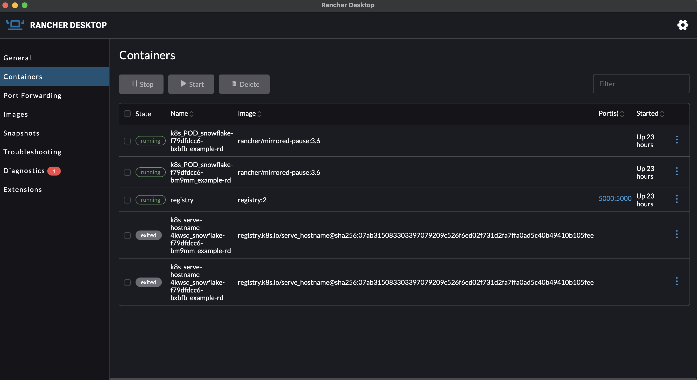

<head>
  <link rel="canonical" href="https://docs.rancherdesktop.io/ui/containers"/>
</head>

import TabsConstants from '@site/core/TabsConstants';

<!--- Insert S3 Image Here Once Uploaded -->
<Tabs groupId="os" defaultValue={TabsConstants.defaultOs}>
<TabItem value="Windows">

</TabItem>
<TabItem value="macOS">

</TabItem>
<TabItem value="Linux">

</TabItem>
</Tabs>

The **Containers** dashboard offers quick access to manage containers and view details such as container state and time started. The listed information can be sorted in ascending or descending order. Containers can also be filtered with input text in the `Filter` field and bulk container selection is available for managing multiple containers at once.

### Container Management

- `Stop`:
  You can terminate container instances using the `Stop` button.
- `Start`:
  You can initiate container instances using the `Start` button.
- `Delete`:
  You can delete container instances from your system entirely by using the `Delete` button.

### Dashboard Details

- `State`:
  The container state(s) will be listed in this field, and by default running containers are presented first.
- `Name`:
  The container name(s) will be listed in this field and can be sorted.
- `Image`:
  All image names will be listed in this field and can be sorted.
- `Port(s)`:
  Ports are listed in this field and can be clicked for quick access to a localhost port.
- `Started`:
  Container start-up times will be listed in this field and can be sorted.
