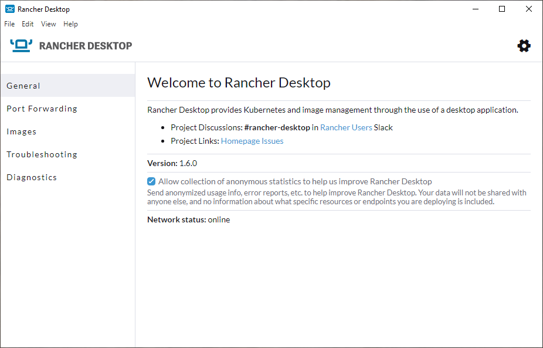

import Tabs from '@theme/Tabs';
import TabItem from '@theme/TabItem';
import TabsConstants from '@site/core/TabsConstants';

The **General** tab provides information on communication channels where users can connect with the Rancher Desktop team and community to ask questions, report bugs, or discuss Rancher Desktop in general.

<Tabs groupId="os" defaultValue={TabsConstants.defaultOs}>
<TabItem value="Windows">

</TabItem>
<TabItem value="macOS">

</TabItem>
<TabItem value="Linux">

</TabItem>
</Tabs>
