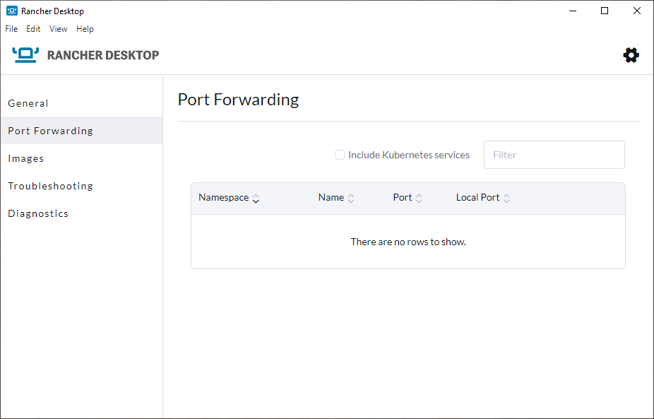

import Tabs from '@theme/Tabs';
import TabItem from '@theme/TabItem';

To forward a port:

1. Find the service and click **Forward**.
1. Specify a port to use or use the randomly assigned port.
1. Click the &check; button to confirm your selection.
1. Optional: click **Cancel** to remove the port assigned.

<Tabs groupId="os">
<TabItem value="Windows">

</TabItem>
<TabItem value="macOS">

</TabItem>
<TabItem value="Linux">

</TabItem>
</Tabs>
