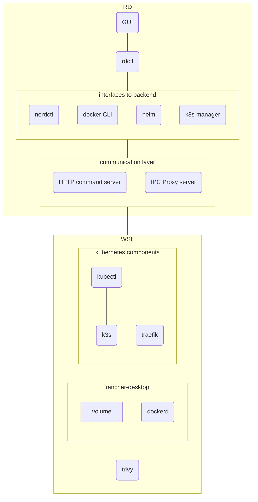
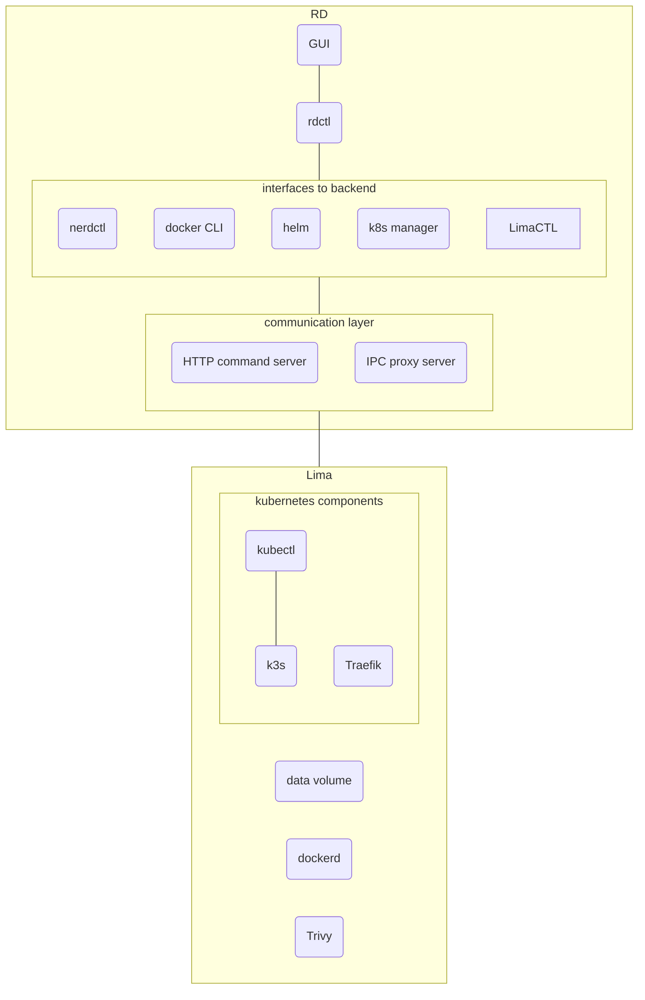
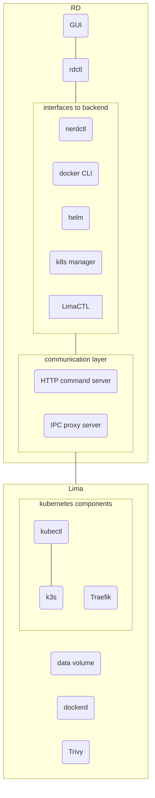

import Tabs from '@theme/Tabs';
import TabItem from '@theme/TabItem';

Rancher Desktop is an electron-based application that wraps other tools while it also provides the user experience to create a simple experience. On macOS and Linux, Rancher Desktop leverages a virtual machine to run containerd or dockerd and Kubernetes. Windows Subsystem for Linux v2 is leveraged for Windows systems. All you need to do is download and run the application.

<Tabs>
<TabItem value="Windows">

## Functional Architecture

</TabItem>

<TabItem value="macOS">

</TabItem>

<TabItem value="Linux">

</TabItem>
</Tabs>
