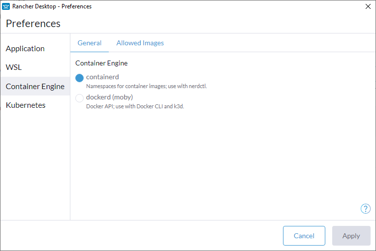
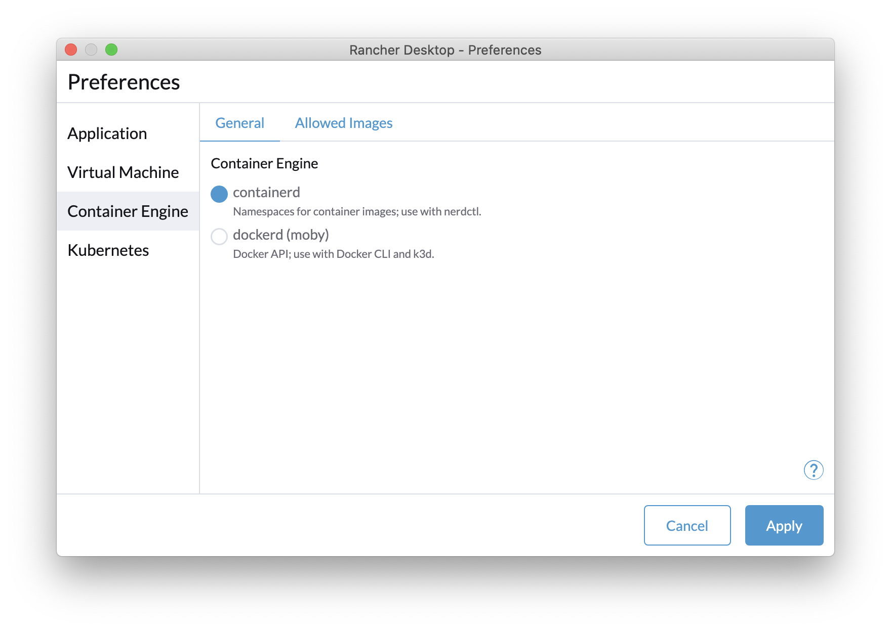
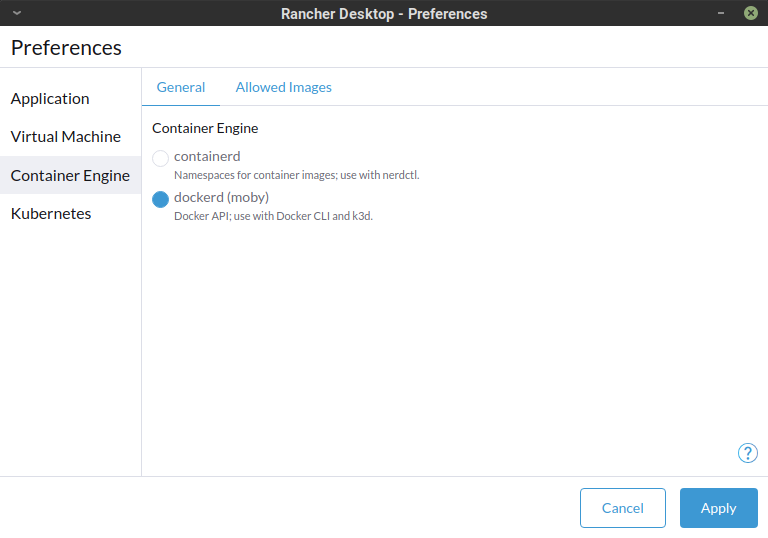
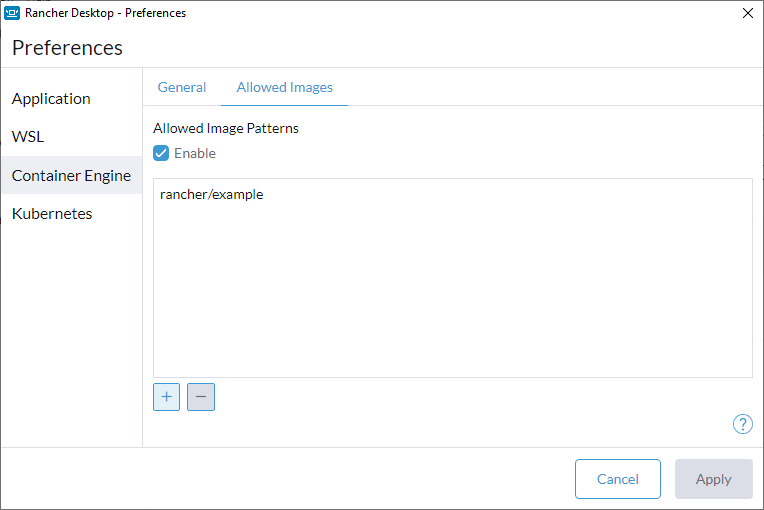
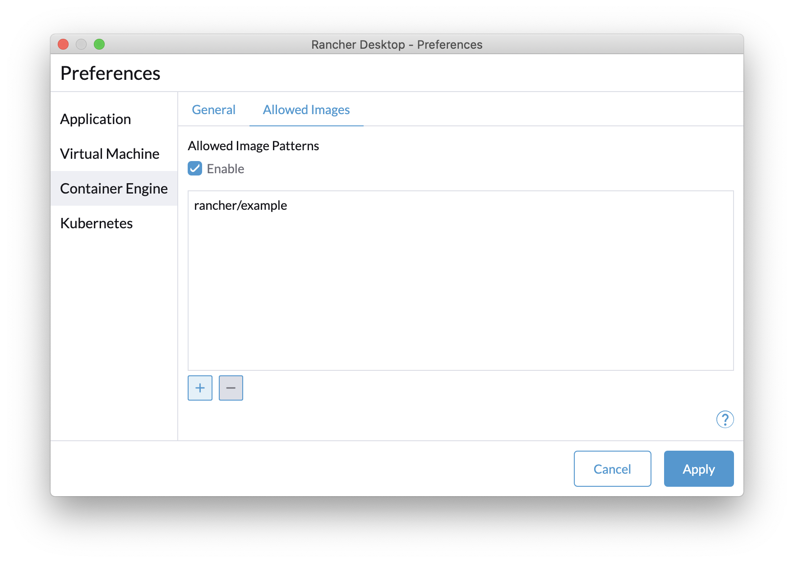
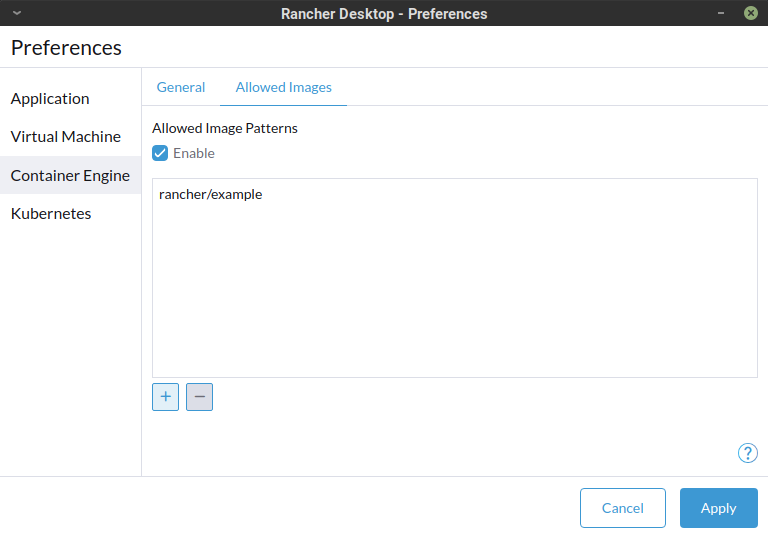

import Tabs from '@theme/Tabs';
import TabItem from '@theme/TabItem';
import TabsConstants from '@site/core/TabsConstants';

## General

Set the [container runtime] for Rancher Desktop. Users have the option of [containerd] which provides namespaces for containers and the use of nerdctl or [dockerd (moby)] which enables the Docker API and the use of the Docker CLI. Only one container runtime will function at a time.

When switching to a different container runtime:

- Workloads and images that have been built or pulled using the existing container runtime are not available on the container runtime being switched to.

<Tabs groupId="os" defaultValue={TabsConstants.defaultOs}>
<TabItem value="Windows">

</TabItem>
<TabItem value="macOS">

</TabItem>
<TabItem value="Linux">

</TabItem>
</Tabs>

## Allowed Images

The `Allowed Images` tab provides options to let you control which registry artifacts you can access within Rancher Desktop. For example, you may want to pull container images only from your organization's private registry or only from your department-specific namespace in your organization's registry, etc. You can specify image URL patterns to allow accessing images only from specific registries and/or repositories.

Check the **Enable** checkbox to enable Rancher Desktop to apply the specified patterns while pulling images, which means only the image URLs that match atleast one of the specified patterns will be allowed.

You can use the **+** and **-** buttons to add/remove image URL patterns. 

<Tabs groupId="os">
<TabItem value="Windows">

</TabItem>
<TabItem value="macOS">

</TabItem>
<TabItem value="Linux">

</TabItem>
</Tabs>

### How to specify Allowed Image patterns

You can specify Allowed Image patterns using the format `[registryServerUrl/][:port/][organization/]repository[:tag]`. Rancher Desktop supports using regular expressions in any part of an Allowed Image pattern string.

> If not specified in an Allowed Image pattern string,
> * `registryServerUrl` defaults to DockerHub registry (`registry-1.docker.io`).
> * `port` defaults to 433, but is optional because the HTTP "Host" header may not include it. 
> * `organization` for DockerHub registry defaults to `library`, and for non-DockerHub registries defaults to no organization.
> * `tag` defaults to anything (not including a `/`) and NOT just to `latest`.

### Examples

| Pattern | Equivalent Fully Formed RegEx | Meaning |
| ------------- | ---------------- | ---------------- |
| busybox | ` ~*^registry-1.docker.io(:443)?/library/busybox/manifests/[^/]+$ 0 ` | Allow all tags of the image `busybox` in the default organization `library` and from the default registry `registry-1.docker.io`|
| suse/ | `~*^registry-1.docker.io(:443)?/suse/[^/]+/manifests/[^/]+$ 0` | Allow any tag of any image in the specified organization `suse` and from the default regsitry `registry-1.docker.io`   **Note:** A trailing slash on the repository means a single segment follows, e.g. "suse/nginx", but not "suse/foo/bar". |
| rancher/mirrored-\[^/\]+ | `~*^registry-1.docker.io(:443)?/rancher/mirrored-[^/]+/manifests/[^/]+$ 0` | Allow any tag of any image whose name starts with `mirrored`, and in the specified organization `rancher` and from the default registry `registry-1.docker.io` |
| registry.suse.com/image | `~*^registry.suse.com(:443)?/image/manifests/[^/]+$ 0` | Allow any tag of the image `image` from the specified registry `registry.suse.com`   **Note:** Non-DockerHub registries do not mandate to have organizations, so can have images at the top level (no default organization `library` is inserted). |
| registry.home:5000 | `~*^registry.home:5000/.+/manifests/[^/]+$ 0` | Allow any tag of any image in any organization (or no organization) and from the specified registry `registry.home:5000` |

[container runtime]:
https://kubernetes.io/docs/setup/production-environment/container-runtimes/

[containerd]:
https://containerd.io/

[dockerd (moby)]:
https://mobyproject.org/
